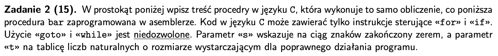
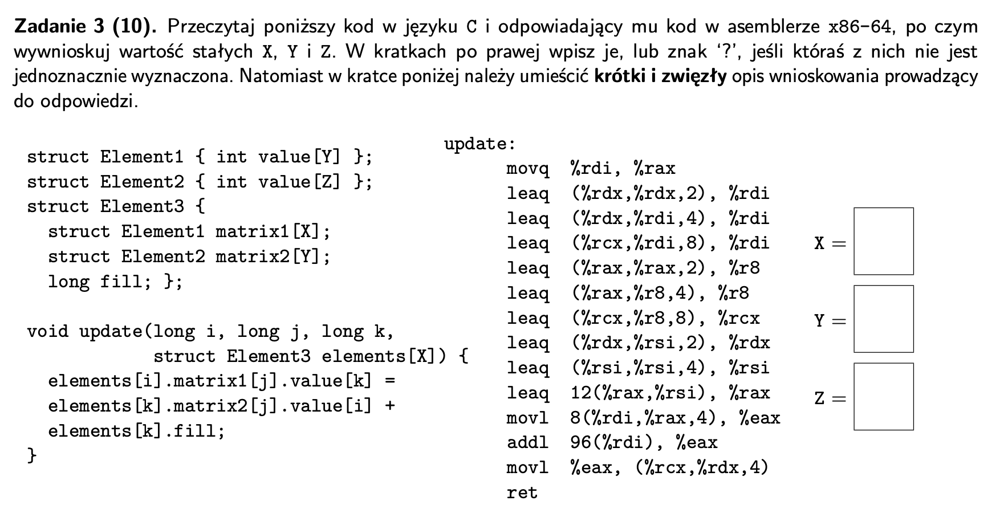
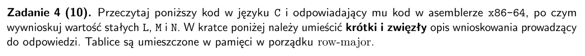
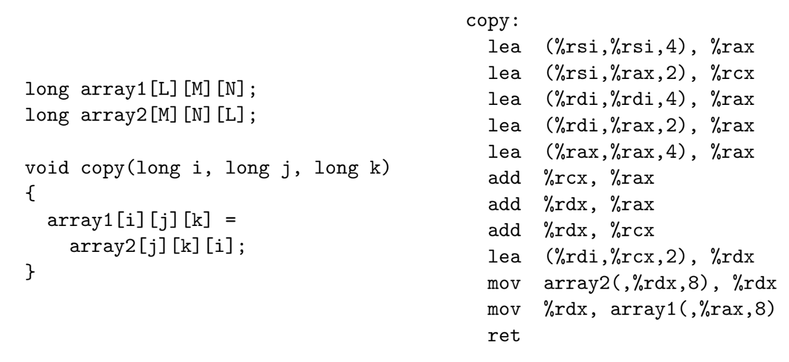
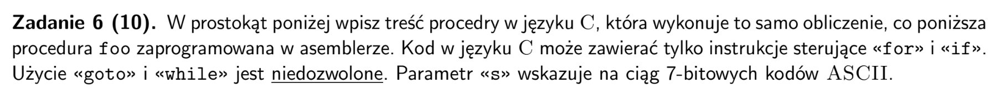
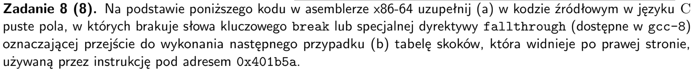
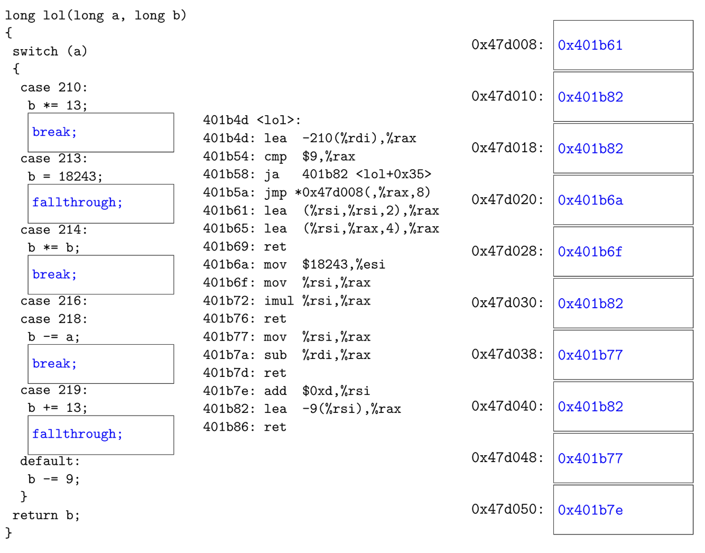
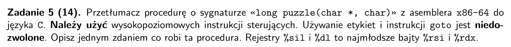
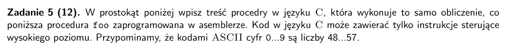

## arkusz 2024



```
bar: 
        movzbl (%rdi), %eax
        testb %al, %al
        je .L1
        movl $0, %edx
        jmp .L5
.L3:    testq %rdx, %rdx
        je .L4
        movq %rdx, (%rsi)
        addq $8, %rsi
        movl $0, %edx
.L4:    addq $1, %rdi
        movzbl (%rdi), %eax
        testb %al, %al
        je .L7
.L5:    cmpb $32, %al
        je .L3
        addq $1, %rdx
        jmp .L4
.L7:    testq %rdx, %rdx
        je .L1
        movq %rdx, (%rsi)
.L1:    ret
```

```
void bar(char *s, size_t *t)
{
    char curr = *s;
    if (curr == '\0') return;
    size_t dl = 0;
    for (size_t i = 0; s[i] != '\0'; i++)
    {
        if (curr != ' ')
        {
            dl += 1;
            s++;
            curr = *s;
            if (curr == '\0') continue;
        }
        if (rdx != 0)
        {   
            *t = dl;
            t++;
            rdx = 0;
        }
        s++;
        curr = *s;
    }
    *t = dl;
    return;
}
```


- z (1) i (3) kazdy element3 zajmuje 104 bajty czyli 4XY + 4YZ + 8 = 104
- czyli `XY + YZ = 24`
- z (3) element matrix1 zajmuje 8, czyli `4*Y = 8`, czyli `Y = 2`
- z (1) jedna matrix1 zajmuje 56 czyli `8*X = 56`, czyli `X = 7`
- czyli `Z = 5`
```
rdi = i, rsi = j, rdx = k, rcx = elems[X]
rax = i
rdi = 3k
rdi = 12k + k = 13k
rdi = elems + 8*13k = elems + 104k
r8 = 2i + i = 3i
r8 = 12i + i = 13i
rcx = elems + 8*13i = elems + 104i
rdx = k + 2*j
rsi = 5j
rax = i + 5j + 12
(1) elems[k].matrix2[j].value[i] = elems + 4i + 20j + 104k + 56
(2) elems[k].fill = elems + 104k + 96
(3) elems[i].matrix1[j].value[k] = elems + 104i + 8j + 4k

```


## arkusz 2019 poprawka





- element `A1[i][j][k]` jest na pozycji `A1 + MNi + Mj + k`
- element `A2[j][k][i]` jest na pozycji `A2 + NLj + Lk + i`
- wiec `L = 2`, `M = 5`, `N = 11`

```
rdi = i, rsi = j, rdx = k
rax = 55i + 11j + k
rdx = i + 2*11j + 2*k 
array1[i][j][k] = array1 + 8*(55i + 11j + k) 
array2[j][k][i] = array2 + 8*(22j + 2k + i)
```



```
foo: 
        xor %eax, %eax
        xor %ecx, %ecx
.L2:    mov (%rdi), %dl
        test %dl, %dl
        je .L7
        inc %rax
        cmp %dl, %cl
        jle .L3
        mov $1, %eax
        .L3: inc %rdi
        mov %edx, %ecx
        jmp .L2
        .L7: ret
```
- mozna uzyc `curr = *s` jako warunku petli i wtedy jednoczenie bedzie sprawdzal `curr != '\0'`!
- rzeczy wykonywane bezposrednio przed skokiem na poczatek petli wrzucamy do sekcji update for'a
- skok warunkowy `jle .L3` trzeba odwrocić jezeli chcemy uzyc `if`
- funkcja wyznacza w stringu s maksymalną długość sufiksu składającego z niemalejących
kodów ASCII
```
long foo(const char *s)
{
    long res = 0;
    char prev = '\0', curr;
    for (; (curr = *s); s++, prev = curr)
    {
        if (curr == '\0') return res;
        res++;
        if (curr < prev) res = 1;
    }
    return res
}
```


- `break` jezeli po kodzie case jest `ret`, w przeciwnym przypadku `fallthrough` (przechodzi do kolejnego przypadku)
- przypadki są ułozone w tablicy po kolei (wszystkie wartosci nawet jezeli nie ma na nie `case`!)
- adres w tablicy skokow odnosi sie do pierwszej instrukcji ktora ma byc wykonana
- jezeli dany przypadek nie istnieje w `switch` odnosimy sie do `default`
- jezeli dany przypadek istnieje w `switch` ale nie ma zadnych instrukcji, odnosimy sie do kodu kolejner `case`



## arkusz 2018

```
1 puzzle:
2       leaq 1(%rdi), %rcx
3       movq %rdi, %r8
4       movq %rdi, %rax
5 .L1:  movb (%r8), %dl
6       testb %dl, %dl
7       je .L4
8       cmpb %dl, (%rcx)
9       jne .L2
10      cmpb %sil, %dl
11      je .L3
12 .L2: movb %dl, (%rax)
13      movq %rcx, %r8
14      incq %rax
15 .L3: incq %rcx
16      jmp .L1
17 .L4: movb $0, (%rax)
18      subq %rdi, %rax
19      ret
```
- wartosc `0` to w ascii `'\0'`
- odwrotnosc warunku na skok do `ret` trzeba dac jako warunek petli
- etykieta `L1` to petla, a `L2` to jej druga połowa
- skoro warunek `cmpb %dl, (%rcx)` skacze do kontynuacji petli `jne` to jako warunek `continue` trzeba dac jego odwrotnosc (`==`)
- warunek `cmpb %sil, %dl` skacze `je` do kolejnej iteracji wiec dajemy go bezposrednio do warunku `continue`
- trzeba zauwazyc ze `incq %rcx` jest zawsze przed skokiem do kolejnej iteracji wiec dajemy go w for

```
long puzzle(char* start, char c)
{
    char* curr_p = start + 1;   // rcx
    char* prev_p = start;       // r8
    char* dest = start;         // rax
    for (; *prev_p != ’\0’; curr_p++)
    {
        char prev = *prev_p;
        if (prev == *curr_p && prev == c) continue;
        *dest = prev;
        dest++;
        prev_p = curr_p;
    }
    *dst = ’\0’;
    return dst - start;
}
```

## arkusz 2018 - poprawka


```
foo: 
    xor %rax, %rax
.L1: 
    movsbq (%rdi), %rdx
    inc %rdi
    lea -48(%rdx), %rcx
    cmp $9, %rcx
    ja .L2
    lea (%rax, %rax, 4), %rax
    add %rax, %rax
    lea -48(%rax, %rdx), %rax
    jmp .L1
.L2: 
    ret
```
- `cmp $9, %rcx` oblicza `digit - 9 > 0`
- `ja` spełnione jezeli `~ZF & ~CF`
- funkcja foo zamienia ciąg cyfr dziesiętnych znajdujący się na początku napisu wskazywanego przez zmienną s na
liczbę bez znaku.
```
unsigned long foo(const char *s)
{
    unsigned long num = 0;
    char c; 
    while (true)
    {
        c = (*s);
        s++;
        if (c > '9') return num;
        num = num * 10 + c - '0';
    }
}
```