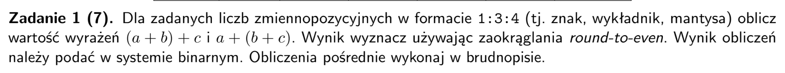
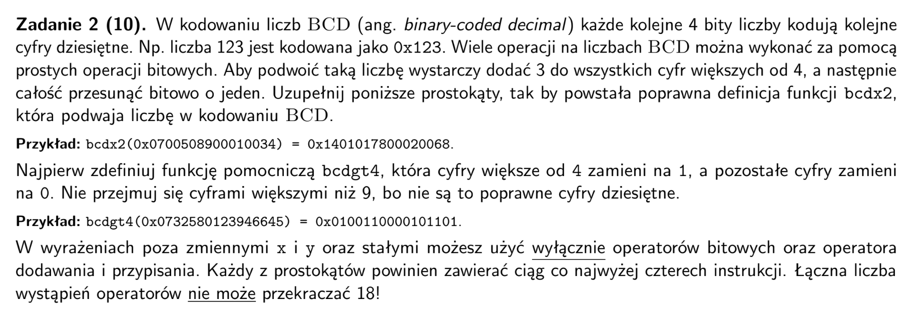
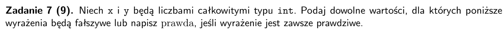
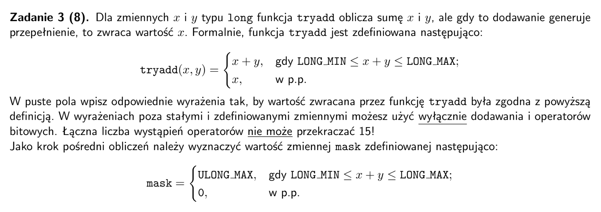
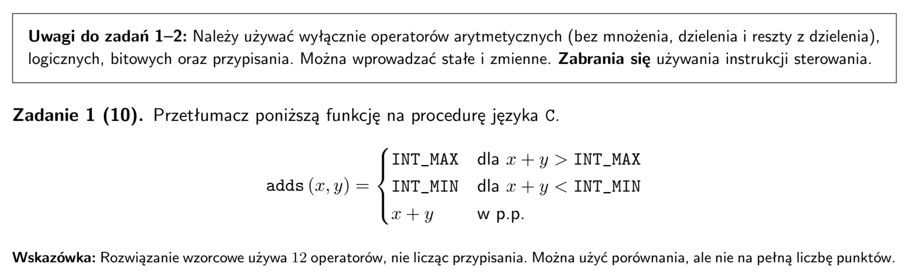
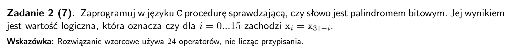
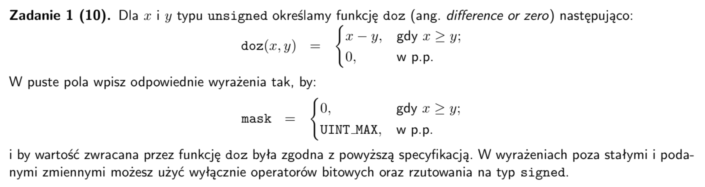
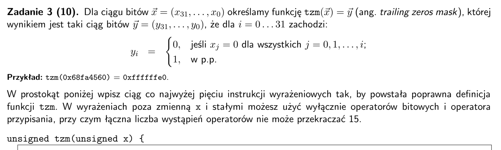
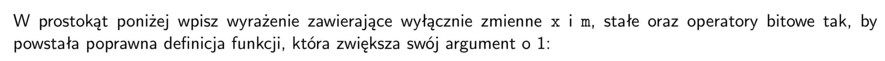

## arkusz 2019 poprawka



- wykladnik jest kodowany jako offset binary, tutaj bias to $2^{m-1} - 1 = 2^{3-1} - 1 = 3$
- liczbe trzeba wyrównac do wiekszej potegi

<div align="center">

| zmienna | binarnie | liczba | potega |
| :---: | :---: |  :---: |  :---: | 
| a | 0 101 0001 | 1.0001 | $2^2$ |
| b | 1 100 1101 | -1.1101 | $2^1$ |
| c | 1 001 0100 | -1.0100 | $2^{-2}$ |

</div>


$ a + b \\
= (1.0001) * 2^2 + (-1.1101) * 2^1 \\
= (1.0001 - 0.11101) * 2^2 \\
= 1.00101 * 2^2 = 0.00101 * 2^2 = 1.0100 * 2^{-1} = (0, 010, 0100) $

$ (a + b) + c \\
= 1.0100 * 2^{-1} + (-1.0100) * 2^{-2} \\
= (1.0100 - 0.1010) * 2^{-1} \\
= 0.1010 * 2^{-1} = 1.0100 * 2^{-2} = (0, 001, 0100)$

$ b + c \\
= (-1.1101) * 2^{1} + (-1.0100) * 2^{-2} \\
= (-1.1101 - 0.0010100) * 2^1 \\
= -1.11111 * 2^1 = -10.0000 * 2^1 = -1.0000 * 2^2 = (1, 010, 0000) $

$ a + (b + c) \\
= (1.0001) * 2^2 + (-1.0000) * 2^2 \\
= (0.0001) * 2^2 = (1.0000) * 2^{-2} = (0, 001, 0000)
$



- wskazówka: W rozwiązaniu wzorcowym bcdgt4 i bcdx2 używają odpowiednio po 3 operatory i 4 operatory.

```
uint64_t bcdgt4(uint64_t x) 
{
    TODO
}

uint64_t bcdx2(uint64_t x) 
{
    uint64_t y = bcdgt4(x);
    TODO

}

```


- `~` to bitowa negacja, a `!` to logiczna negacja
- `~x + 1` to zamiana znaku w U2
```
(x ^ y) < 0  ---> x = 0, y = 0
((~(x | (~x + 1)) >> 31) & 0x1) == !x ---> PRAWDA
(x ^ (x>>31)) - (x>>31) > 0 ---> x = 0 
((x >> 31) + 1) >= 0 ---> PRAWDA
(!x | !!y) == 1 ---> x = 1, y = 0
x ^ y ^ (~x) - y == y ^ x ^ (~y) - x ---> x = 1, y = 0
```



- Wskazówka: W rozwiązaniu wzorcowym użyto 7 operatorów.

```
long tryadd(long x, long y) 
{
    long sum = x + y;
    long mask = 
    return 
}
```

## arkusz 2018

- `(~(x ^ y))` daje 1 jezeli `x` i `y` maja te same znaki
- `(y ^ sum)` daje 1 jezeli `y` i `sum` maja rozne znaki
- `>> 31` izoluje nam bit znaku bo tylko na niego patrzymy
- jezeli mamy `x + y > INT_MAX` to `sum` jest ujemna, czyli pierwszy bit `1`
    - chcemy zrobic z tego `INT_MAX` czyli `011...`
    - mozna uzyc `((sum >> 31) ^ INT_MIN)`
    - `(sum >> 31)` artmetyczne stworzy `111...`
    - `111... ^ 100... = 0111...`, czyli INT_MAX
- analogicznie dla `x + y < INT_MIN`
- `| (~over & sum)` zapewnia ze w.p.p. zwracamy wynik dodawania
    - bo wtedy `over` = 0, wiec pierwsza czesc zwraca `0`
    - `0 | sum` zwraca sum

```
int adds(int x, int y)
{
    int sum = x + y;
    int over = ((~(x ^ y)) & (y ^ sum)) >> 31
    return (over & ((sum >> 31) ^ INT_MIN)) | (~over & sum);
}
```


- `high` izoluje gorna polowe bitów (bedziemy do niej porownywać)
- `low` izoluje dolna polowe bitow 
- potem odwracamy kolejnosc bitow `high`
    - maskowanie fragmentow i przesuwanie ich na pozycje docelowa
- `^` weryfikuje czy `low` i odwrocone `high` sa równe
```
unsigned palindrome(unsigned x)
{
    unsigned high = (x >> 16);
    unsigned low = (x & 0xFFFF);
    high = ((high & 0xFF00) >> 8) | ((high & 0x00FF) << 8);
    high = ((high & 0xF0F0) >> 4) | ((high & 0x0F0F) << 4);
    high = ((high & 0xCCCC) >> 2) | ((high & 0x3333) << 2);
    high = ((high & 0xAAAA) >> 1) | ((high & 0x5555) << 1);
    return !(lo ^ hi);
}
```

## arkusz 2018 poprawka



- funkcja przydatna do implementowania min i max: `max(x, y) = y + doz(x, y)` oraz `min(x, y) = x - doz(x, y)`
- w C dla unsigned `>>` jest logiczny (uzupełnia zerami)
- w C dla signed `>>` jest arytmentyczny (uzupełnia bitem znaku)
- patrzymy tylko na najstarszy bit (bo `>> 31`)
    - `(~x & y) == 1` dla sytuacji gdy x < y
    - `((~x ^ y) & diff) == 1` wykrywa overflow 
        - gdy (x = 1 i y = 1) lub (x = 0 i y = 0) a (x - y) = 1
    - `(signed)` zapewnia ze `>>` bedzie arytmetyczne a nie logiczne
```
unsigned doz(unsigned x, unsigned y) 
{
    unsigned diff = x - y;
    unsigned mask = (signed)((~x & y) | ((~x ^ y) & diff)) >> 31;
    return diff & (~mask);
}
```


- chcemy dodawac bity 1, wiec najlepszym wyborem jest alternatywa

```
x = x | (x << 1);
x = x | (x << 2);
x = x | (x << 4);
x = x | (x << 8);
x = x | (x << 16);
```


- `tzm(x)` zwraca maske na wszystkie bity od piewszego zapalonego w góre
- wiec `tzm(~x)` zwraca maske na wszystkie bity od pierwszego niezapalonego bitu
- m wyznacza pozycje gdzie trzeba dodac 1, wiec zeby wyizolowac tylko te pozycje uzywamy `m ^ (m << 1)`
- x maskujemy zeby wyzerowac te dolne jedynki 
- laczymy wyniku uzywajac alternatywy

```
unsigned increment(unsigned x) 
{
    unsigned m = tzm(~x);
    return
}
```