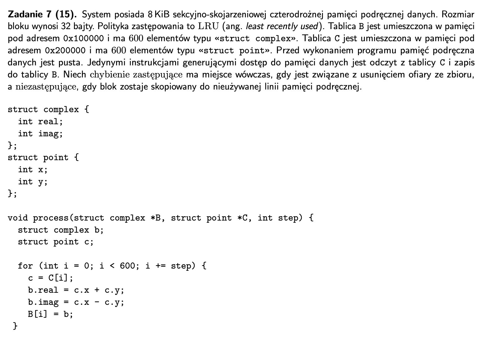
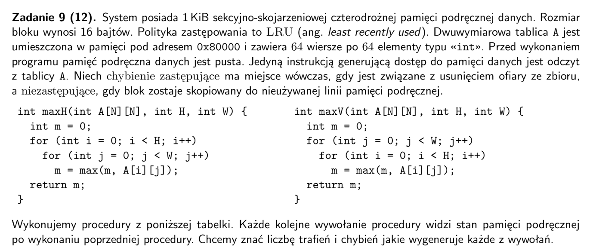
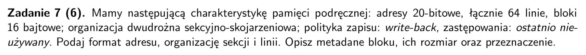
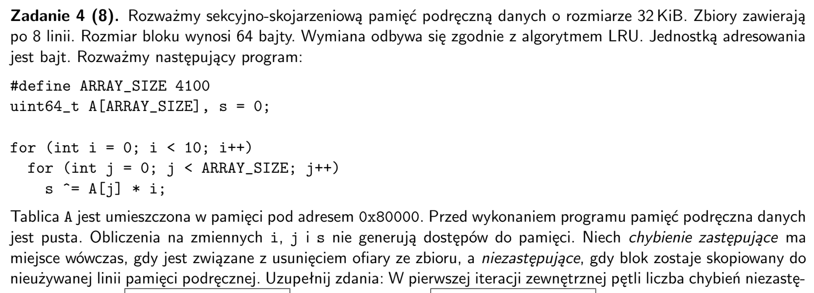

## arkusz 2024



- pamiec = 8 KiB = 8 * 2^10 = `2^13`
- liczba linii w zestawie = `4`
- liczba bajtow w bloku = `32`
- liczba zestawow = $2^{13} / (2^2 * 2^5) = 2^{6} = 64$
- rozmiar elementow = `8` bajtow
- liczba elementow wczytywanych jednoczesnie = `4`
- bity na offset = `5`, bity na index = `6`
-----
- cache: pusty
- odwolania do wszystkich elementow `C[i]` i `B[i]` jednoczesnie
- skoro odnosimy sie do kolejnych elementow to kazdy miss ma potem `3` hity (bo wczytujemy po 4 elementy do linii)
- pierwsze dwa przejscia przez caly cache to chybienia niezastepujace: 4 (linie) * 64 (zestawy) = `256`
- te dwa przejscia wczytaja z kazdej tablicy po 2 (linie) * 64 (zestawy) * 4 (elementy) = `512` elementow
- wiec reszta wczytan do cache to chybienia zastepujace: 2 * (600 - 512) / (4 (elementy na linie)) = `44`
- czyli pierwsze `11` zestawow zostanie nadpisane
- trafien: (256 + 44) * 3 = `900`
-----
- cache: cały wypełniony po dwie linie z `B` i po dwie z `C`, w sumie ostatnie `512` elementow z kazdej
- odwołania do wszystkich parzystych elementow
- nie odwołujemy sie juz do kolejnych elementow wiec na 1 miss mamy tylko `1 hit` (bo wczytujemy 4 elementy)
- zeby odniesc sie do indeksow `[0, 88)` znowu nadpisujemy pierwsze `11` zestawow, czyli w sumie 11 * 4 = `44` chybienia zastepujace
- potem do konca cache sa trafienia: (64 - 11) (zestawy) * 4 (linie) * 2 (elementy) = `424` trafien
- ostatnie elementy tablic znowu nadpisujemy w pierwszych `11` zestawach cache, czyli `44` chybienia zastepujace
- dla kazdego chybienia zastepujacego mamy tez jego trafienie wiec w sumie 424 + 44 + 44 = `512` trafien
----
- wczytujemy co 8 elementow, czyli co drugi 
- czyli na pierwsze elementy `11` chybien niezastepujacych
- potem do konca cache `53` hity
- na ostatnie elementy znowu `11` chybien niezastepujacych

| wywołanie | trafienia | chybienia zastępujące | chybienia niezastępujące |
| :---: | :---: | :---: | :---: | 
| process(B, C, 1); | 900 | 44 | 256 |
| process(B, C, 2); | 512 | 88 | 0 |
| process(B, C, 8); |

## arkusz 2019 poprawka


- suma pamieci = 1KiB = `1024` bajty
- liczba linii na zestaw = `4`
- rozmiar bloku = `16` bajtów
- liczba zestawow = $\frac{2^{10}}{2^2 * 2^4} = 2^4 = 16 $ zestawow
- w sumie 16 * 4 = `64` linie
- `A` - 4096 elementow `int`
- 1 linia cache = `4` elementy z `A`
- polityka `LRU`
- bity offset = 4, bity index = 4
------
- cache: `pusty`
- pierwsze wywołanie wstawia do cache elementy `A[0][0] - A[0][63]` oraz `A[1][0] - A[1][63]`
- w sumie `128` elementow, czyli `32` linie cache
- czyli `32` trafienia niezastepujace, bo cache byl pusty na poczatku
- kazde 1 wczytanie linii to 4 elementy wiec `3` trafienia
- wiec w sumie 3 * 32 = `96` trafien
-----
- cache: kazdy zestaw wypelniony po `2` linie
- drugie wywołanie wstawia elementy `A[0][0], A[1][0], ... A[64][0]` oraz `A[0][1], A[1][1], ... A[64][1]`
- kazdy wiersz `A` zawiera `64` elementy, czyli mieści sie w `16` liniach cache
- wiec wszystkie rzedy bedza wczytywane do `zestawu 0`
- trafienia dla A[0][0], A[1][0]
- chybienie niezastepujace dla A[2][0], A[3][0]
- reszta chybienia zastepujace 
- az 128 - 2 - 2 = `124`, bo wczytanie jedenej linii cache daje nam tylko jedna liczbe
------
- cache: kazdy zestaw wypełniony po `2` linie poza 0. ktory jest wypełniony `A[61][1], A[62][1], A[63][1], A[64][1]`
- wczytujemy całe A `rząd po rzędzie`
- trafienia dla rzedow ktore juz sa w cache, czyli 15 * 2 * 4 = `120` + dla 3 elementow z kazdego chybienia = 994 * 3 = `2982`, w sumie `3102`
- chybienia niezastepujace dla pozostalych zestawow, czyli 15 * 2 = `30`
- reszta chybienia zastepujace
----
- cache: cały wypełniony, np w 16. zestawie mamy linie `A[64][48], A[64][52], A[64][56], A[64][60]`
- wczytujacemy całe A `kolumna po kolumnie`
- kazdy element kolumny jest w innej linii (4 bajty)
- wiec kazde wczytanie to chybienie zastepujace = 64 * 64 = `4096`

| wywołanie | trafienia | chybienia zastępujące | chybienia niezastępujące |
| :---: | :---: | :---: | :---: | 
| maxH(A, 2, 64); | 96 | 0 | 32 |
| maxV(A, 64, 2); | 2 | 124 | 2 |
| maxH(A, 64, 64); | 3102 | 964 | 30 |
| maxV(A, 64, 64); | 0 | 4096 | 0 |

## arkusz 2018


- liczba linii na blok = `2`
- rozmiar bloku = `16` bajtow
- liczba blokow = 64 / 2 = `32`
- bity na offset = `4` (bo 16 bajtow na blok)
- bity na index = `5` (bo 32 bloki)
- bity na tag = 20 - 5 - 4 = `11`
- write-back oznacza ze uzupelniamy nowe dane w pamieci dopiero gdy dana linia jest wyrzucana z cache 
- bit `dirty` wyznacza czy linia byla modyfikowana
- bit `valid` wyznacza czy linia jest wypelniona prawidlowymi danymi

```
adres = (tag, index, offset)
linia cache = (bit dirty, bit valid, tag, blok)
```


## arkusz 2018 - poprawka



- rozmiar pamieci = 32 KiB = $32 * 2^{10}$ bajty
- rozmiar bloku = 64 bajty
- rozmiar zbioru = 8 linii
- liczba zbiorów = pamiec / (liczba linii w zbiorze * rozmiar bloku) = $\frac{32 * 2^{10}}{8 * 2^6} = 64$
- liczba linii w sumie = 64 * 8 = `512`
- bity na offset = log2(64) = `6`
- bity na index = log2(64) = `6`
- bity na tag = 64 - 12 = `52`
- adres tablicy A = 0x80000
- w algorytmie `i` razy przechodzimy caly fragment tablicy `A[j, 4100]`
- elementy `A` to unit64_t, czyli maja `8 bajtow`
- pamiec tablicy A = `4100 * 8 = 32 800`
- liczba linii cache na tablice A = 32 800 / 64 = `512.5` linii 
-----------------------
- pierwsza iteracja `A[0 - 4100]`
    - chybienia niezastapujace = `512` (wypelnienie calego poczatkowo pustego cache)
    - chybienia zastepujace = `1` (ostatnia iteracja)
- druga iteracja `A[0 - 4100]`
    - chybienia niezastepujace = `0`
    - chybienia zastepujace = `9` (w pierwszym zestawie cache)
- laczna liczba chybien w calym algorytmie = `513 + 9 * 9 = 594`
- wczytywana jest cała linia cache na raz! czyli tutaj po 8 elementów tablicy A

| zbior 1 | polowia pierwszej iteracji | po pierwszej iteracji | polowa drugiej iteracji
|:---:|:---:|:---:|:---:|
| linia 1 | A[0, 7] | A[4096, 4099] | A[56, 63]
| linia 2 | A[8, 15] | bez zmian | A[0, 7]
| linia 3 | A[16, 23] | bez zmian | A[8, 15]
| linia 4 | A[24, 31] | bez zmian | A[16, 23]
| linia 5 | A[32, 39] | bez zmian | A[24, 31]
| linia 6 | A[40, 47] | bez zmian | A[32, 39]
| linia 7 | A[48, 55] | bez zmian | A[40, 47]
| linia 8 | A[56, 63] | bez zmian | A[48, 55]
