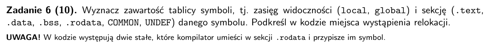
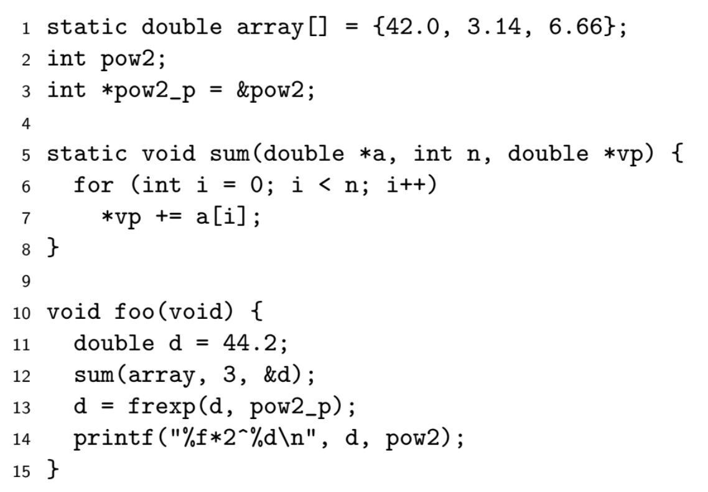
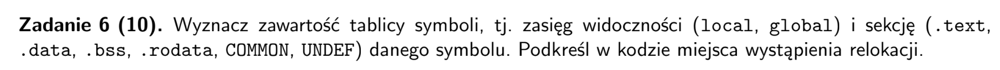
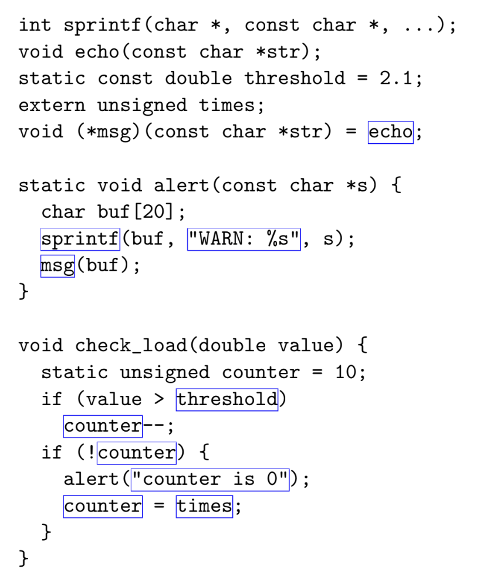

* do sekcji common ida globalne zmienne niezainicjalizowane!
* stringi przekazywan do funkcji tez są symbolami

## arkusz 2018

| symbol | zasieg | sekcja | komentarz |
| :---: | :---: | :---: | :---: |
| array | local | .data | static czyli lokalny |
| pow2 | global | common | globalna zmienna niezdefiniowana! |
| pow2_p | global | .data | bo ma definicje |
| sum | local | .text | lokalna bo static |
| foo | global | .text | funkcje domyslnie sa globalne | 
| 44.2 | local | .rodata | ??????? glupie | 
| frexp | global | undef | bo definicja gdzie indziej |
| printf | global | undef | bo definicja gdzie indziej|
| "%f*2^%d\n" | local | .rodata | bo tylko do odczytu |

## arkusz 2018 - poprawka

- wystapienia relokacji - miejsca, gdzie linker musi podstawic adres symbolu
    - wszystkie uzycia symboli poza ich deklaracja

| symbol | zasieg | sekcja | komentarz |
| :---: | :---: | :---: | :---: |
| sprintf | global | undefined | bo definicja jest w innym pliku | 
| echo | global | undefined | bo definicja jest w innym pliku |
| threshold | local | .rodata | bo const | 
| times | global | undefined | bo extern |  
| msg | global | .data | bo zainicjalizowany |
| alert | local | .text | bo static |
| "WARN: %s" | local | .rodata | string tylko do odczytu |
| check_load | global | .text | |
| counter | local | .data | bo zainicjalizowany |
| "counter is 0" | local | .rodata | string tylko do odczytu |

