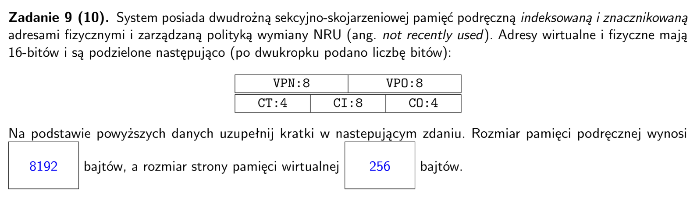
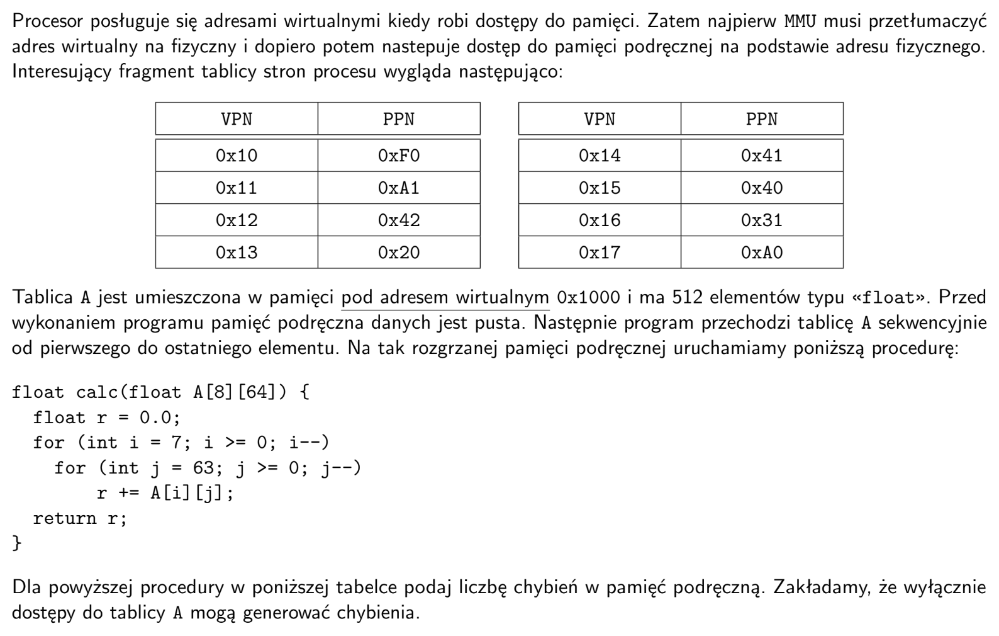
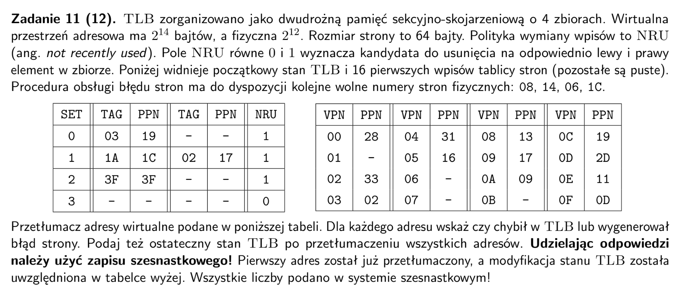

## arkusz 2022

- skoro `VPO` ma 8 bitow to oznacza ze strona ma 2^8 = `256` bajtow
- skoro `CO` ma 4 bity to kazda linia ma 2^4 = `16` bajtow
- skoro `CI` ma 8 bitów to pamiec podreczna ma 2^8 = `256` zestawow
- skoro pamiec jest drudrozna to kazdy zestaw ma `2` linie
- wiec rozmiar pamieci to 2 * 256 * 16 = `8192` bajtow

- `A`: `8` rzedow po `64` elemety po `4` bajty
- cache ma `16` bajtow na linie wiec wczytujemy po `4` elementy tablicy A
- jezeli VA to `0x1000` to PA to `0xF000`, wiec `CI` to `00` (dwa srodkowe bity PA)
- do kolejnego zestawu trafi dopiero adres `0x1010`, czyli `4` elementy dalej
- jezeli A[0] jest pod `0x1000` to pod `0x1100` jest A[64], czyli jeden VPN odpowiada calemu rzedowi `A`
- czyli w obrebie jednego rzedu `A` wpisujemy do cache zestaw po zestawie (`16` zestawow)
- a dla kazdego nowego rzedu wyznaczamy nowy startowy index z PPN
------
- cache: pusty, `256` zestawow po `2` linie po `4` elementy A
- przejscie calej `A` po kolei `rzedami`
- potrzebujemy `128` linii, ale gdzie trafia do cache zalezy od PPN a nie VPN
-----

| wczytywanie rzedu | PPN | CI (hex) | wypelnione cache | czy nadpisane dalej? |
| :---: | :---: | :---: | :---: | :---: |
| A[0] | F0 | 00 | [0, 15] | tak | 
| A[1] | A1 | 10 | [16, 31] | tak |
| A[2] | 42 | 20 | [32, 47] | nie |
| A[3] | 20 | 00 | [0, 15] | tak |
| A[4] | 41 | 10 | [16, 31] | nie |
| A[5] | 40 | 00 | [0, 15] | nie |
| A[6] | 31 | 10 | [16, 31] | nie |
| A[7] | A0 | 00 | [0, 15] | nie |

- sprawdzamy ktore rzedy zostaly nadpisane przy powyzszych wywołaniach
- jezeli linii nie ma w cache to mamy 1 chybienie na 4 elementy, czyli 64/4 = `16`

| dostepy | chybienia | 
| :---: | :---: |
| A[7][0..63] | 0 |
| A[6][0..63] | 0 |
| A[5][0..63] | 0 |
| A[4][0..63] | 0 |
| A[3][0..63] | 16 |
| A[2][0..63] | 0 |
| A[1][0..63] | 16 |
| A[0][0..63] | 16 |

## arkusz 2019 poprawka

- kolejne wolne numery stron fizycznych: `08, 14, 06, 1C`
- adres wirtualny - `14` bitow (bo wirtualna przestrzen adresowa ma $2^{14}$ bajtow)
- adres fizyczny - `12` bitow (bo fizyczna przestrzen adresowa ma $2^{12}$ bajtow)
- bity VPO = log2(64) = `6` (bo adresuje bajt wewnatrz jednej strony)
- bity VPN = 14 - 6 = `8`
- bity TLBI = `2` (bo TLB ma 4 zbiory)
- bity TLBT = 8 - 2 = `6` (bo TLBT + TLBI = VPN)

| Virt | Bin | Phys | VPN | PPN | Index | Tag | Miss | Fault |
|:---:|:---:|:---:|:---:|:---:|:---:|:---:|:---:|:---:|
| 1A7C |01 1010 0111 1100 | 73C | 69 | 1C | 1 | 1A | NIE | NIE |
| 03E1 |00 0011 1110 0001 | 361 | 0F | 0D | 3 | 03 | TAK | NIE | 
| 1964 | 01 1001 0110 0100 | 224 | 65 | 08 | 1 | 19 | TAK | TAK |
| 0240 | 00 0010 0100 0000 | 5C0 | 09 | 17 | 1 | 02 | TAK | NIE |
| 3FAA | 11 1111 1010 1010 | FEA | FE | 3F | 2 | 3F | NIE |NIE | 

| SET | TAG | PPN | TAG | PPN | NRU |
|:---:|:---:|:---:|:---:|:---:|:---:|
| 0 | 03 | 19 | - | - | 1 |
| 1 | 02 | 17 | 19 | 08 | 0 |
| 2 | 3F | 3F | - | - | 1 |
| 3 | 03 | 0D | - | - | 1 |
