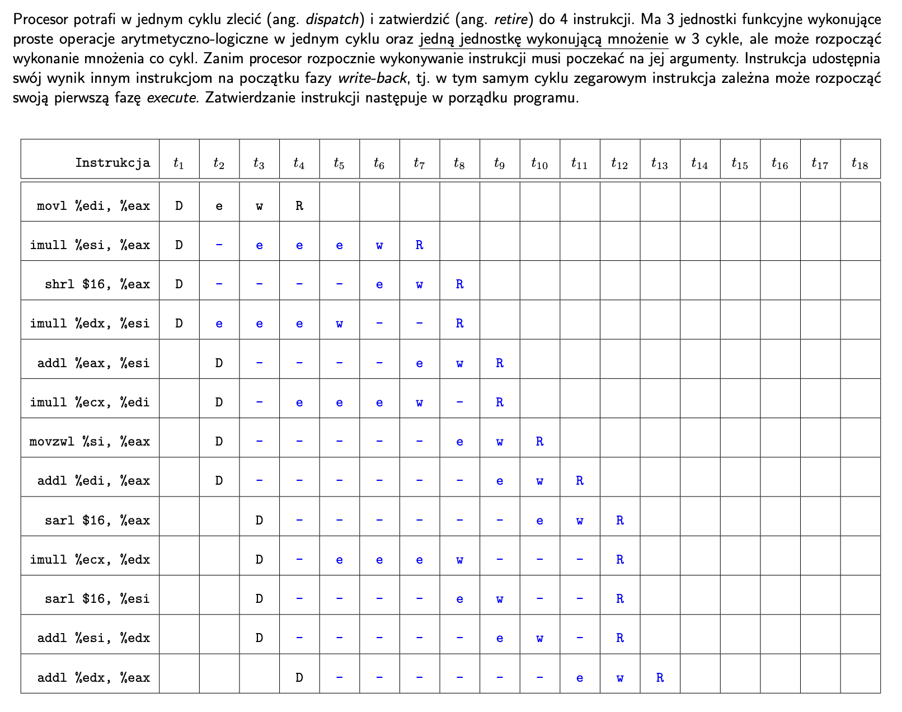
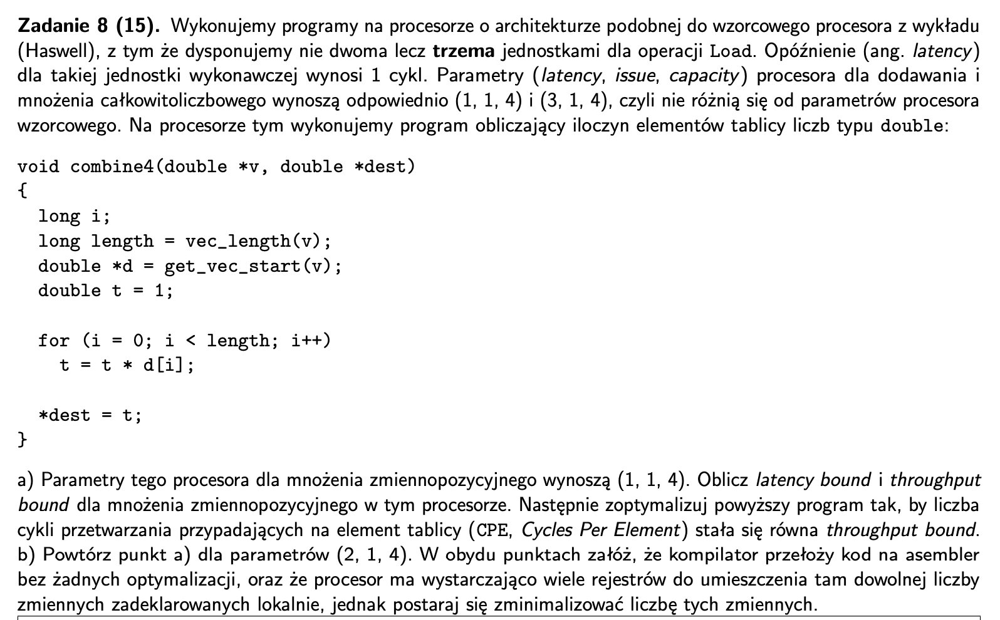
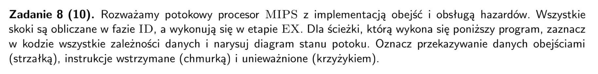
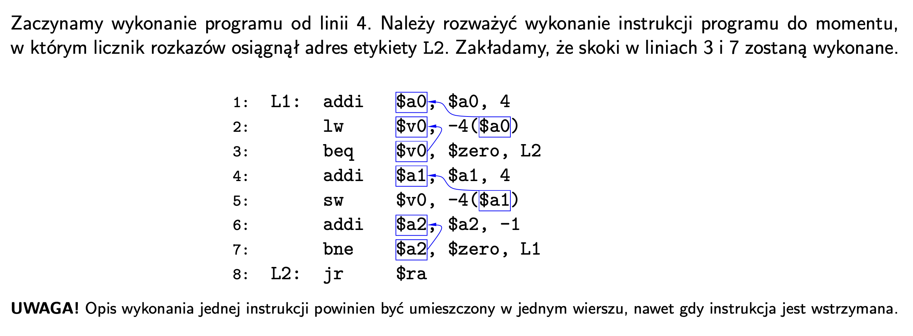

## 2024

- etapy `R`etire musza byc w oryginalnej kolejnosci
- jedna jednostka mnozenia moze wykonywac trzy mnozenia rownoczesnie bo w kazdym cyklu moze wyslac nowe
- zaleznosci miedzy danymi - trzeba poczekac na koniec `e`xecute bo forwarding przekaze dane





- latency - liczba cykli potrzebnych na wykonanie operacji
- issue - co ile cykli mozna wystartowac kolejna instrukcje do danej jednostki
- capacity - ilosc jednostek dzialajacych rownolegle
- latency bound - minimalna liczba cykli potrzebnych do przetworzenia elementu (cycles per element, CPE)
wynikająca wyłącznie z zależności danych
- throughoutput bound - minimalna CPE wynikająca wyłącznie z liczby jednostek funkcyjnych.

-------
- load - 3 jednostki
- dodawanie calkowitoliczbowe - latency = 1, issue = 1, capacity = 4
- mnozenie calkowitoliczbowe - latency = 3, issue = 1, capacity = 4
- mnozenie zmiennopozycjne - latency = 1, issue = 1, capacity = 4
---
- w petli kazdy wynik mnozenia zalezy od poprzedniego wyniku wiec `latency bound` to 1 cykl/element
- `throughput bound` to teoretyczna przepustowosc czyli ile elementow jednoczesnie jestesmy w stanie przetwarzac (niezaleznie jak dlugo), tu ograniczona przez load ktory ma issue 3


```
for (...)
{
    t1 = t1 * d[i];
    t2 = t2 * d[i+1];
    t3 = t3 * d[i+2];
}
t = t1 * t2 * t3;
```
- jezeli mamy (1, 2, 4) to throughput bound to 


## 2018 - poprawka





- kolejnosc wykonywania rozkazow: `IF`, `ID`, `EX`, `MEM`, `WB`
- `()` oznacza instrukcje wstrzymana, `-` oznacza anulowana
- zanim skok sie wyliczy zaczynamy przetwarzac kolejna instrukcje na wszelki wypadek
- skok potrzebuje informacji juz do fazy ID
- jezeli instrukcja uzywa informacji z poprzedniej instrukcji moze poczekac tylko na wykonanie `EX`
- ale jezeli instrukcja 

| instrukcja | notatka | t1 | t2 | t3 | t4 | t5 | t6 | t7 | t8 | t9 | t10 | t11 | t12 | t13 | t14 | t15 | t16 | t17 | t18 |
|:---:|:---:|:---:|:---:|:---:|:---:|:---:|:---:|:---:|:---:|:---:|:---:|:---:|:---:|:---:|:---:|:---:|:---:|:---:|:---:|
| addi $a1, $a1, 4 |brak zaleznosci| IF | ID | EX | MEM | WB |
| sw $v0, -4($a1) |zalezy od poprzedniego wyniku|  | IF | ID | EX | MEM | WB |
| addi $a2, $a2, -1 |brak zaleznosci| | | IF | ID | EX | MEM | WB |
| bne $a2, $zero, L1 |skok potrzebuje a2 juz do ID| | |  | IF | (ID) | ID | EX | MEM | WB |
| jr $ra |???| | | | | (IF) | (IF) | X | X | X | X|
| addi $a0, $a0, 4 |po skoku| | | | | | | IF | ID | EX | MEM | WB |
| lw $v0, -4($a0) |zalezne od a0| | | | | | |  | IF | ID | EX | MEM | WB |
| beq $v0, $zero, L2 |ID czeka na MEM bo lw laduje dane do pamieci| | | | | | | | | IF | (ID) | (ID) | ID | EX | MEM | WB |
| addi $a1, $a1, 4 |anulowane| | | | | | | | | | (IF) | (IF) | IF | X | X | X | X |
| jr $ra || | | | | | | | | | | | | IF | ID | EX | MEM | WB |
