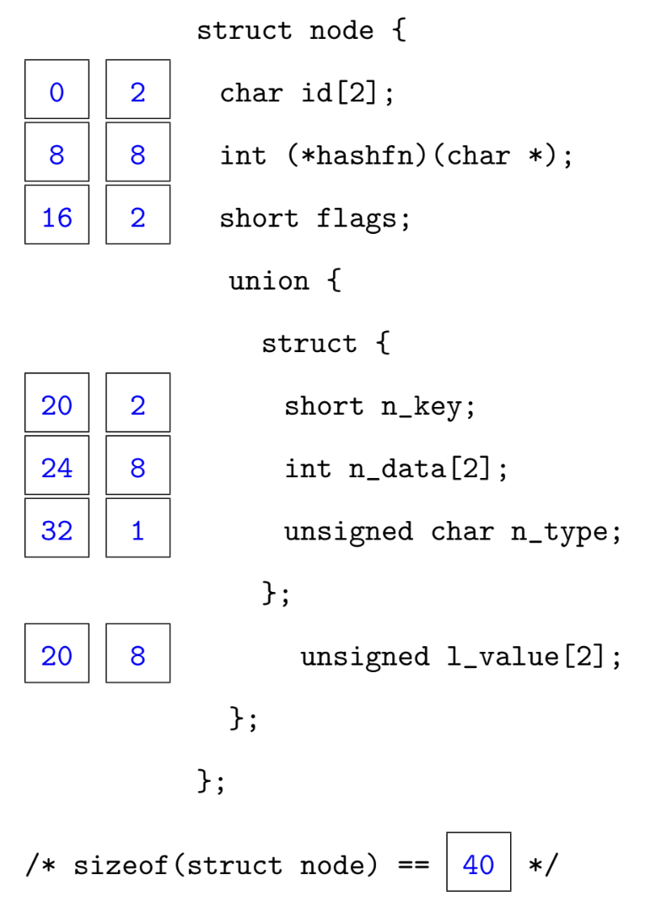
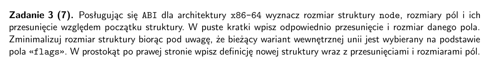
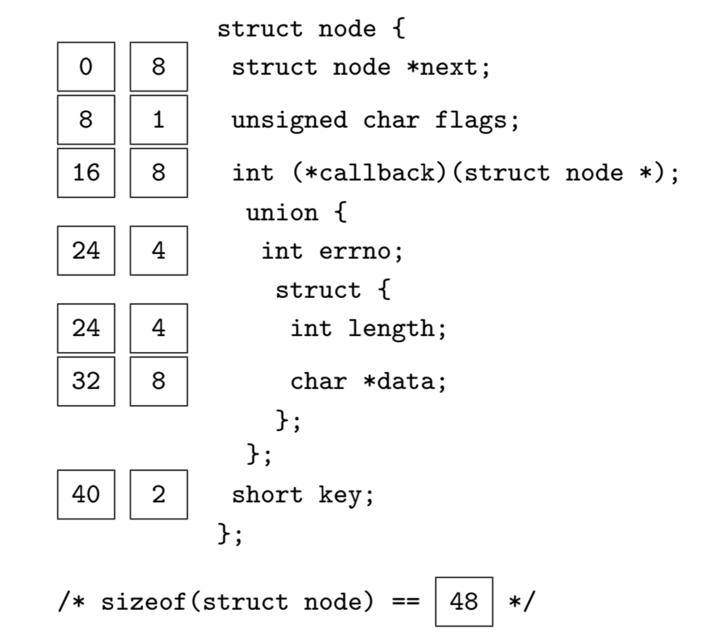
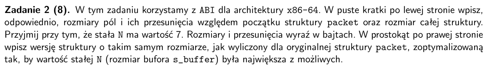
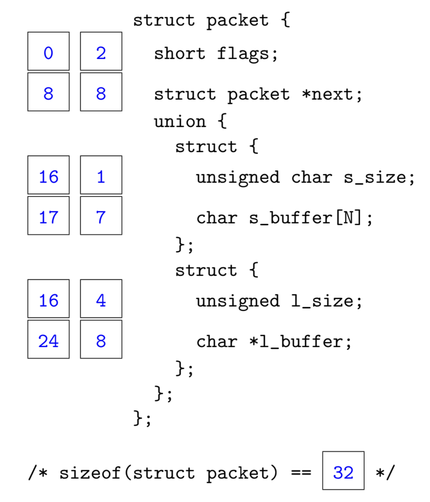

## arkusz 2019 poprawka


<p align="center">
  
</p>

- przed union potrzebny padding `2` bajty, bo alignof() = 4
- int n_data[2] ma `8` bajtow bo ma dwa inty
- pelen rozmiar to `35` ale skoro alignof(node) = 8, to ostateczny rozmiar to `40`

```
struct node
{
    int (*hasfn)(char*);             // 0, 8
    union
    {
        struct
        {
            int n_data[2];           // 8, 8
            short n_key;             // 16, 2
            unsigned char n_type;    // 18, 1
        };
        unsigned l_value[2];         // 8, 4
    };
    short flags;                     // 20, 2
    char id[2];                      // 22, 2
}
sizeof(node) = 24
```

## arkusz 2018

<p align="center">
  
</p>

- `int (*callback)(struct node*)` to wskaźnik!
- wewnetrzny struct ma rozmiar `16` i alignment requirement `8` od wskaznika
- wiec unia ma rozmiar `16` i alignment requirement `8`
- rozmiar `struct node` to 42, ale zeby wyrownać do wielokrotności `8` mamy `48`

```
struct node 
{
    struct node *next;                  // 0, 8
    int (*callback)(struct node*);      // 8, 8
    union                               // 16, 12
    {
        struct
        {
            char *data;                 // 16, 8
            int length;                 // 24, 4
        }
        int errno;                      // 16, 4
    }
    short key;                          // 28, 2
    unsigned char flags;                // 30, 1
    padding                             // 31, 1
}
sizeof(struct node) = 32
```

## arkusz 2018 poprawka


<p align="center">
  
</p>

- po flags mamy padding, bo `alignof(wskaznik) = 8`
- pierwszy struct w unii ma pamiec `1 + 7 = 8`, bo `alignof(char) = 1` (nie liczy sie ze to tablica)
- drugi struct w unii ma pamiec `4 + 4 + 8 = 16`, bo `size(unsigned) = 4` i `alignment(char*) = 8`, wiec dodajemy 4 bajty paddingu
- sizeof() unii to sizeof() jej najwiekszego elementu, wiec 16
- pamiec packet to `2 + 6 + 8 + 16 = 32` (juz aligned do 8)
- optymalizacja uwzglednia ulozenie od najwiekszego alignment requirement do najmniejszego
- jezeli chcemy zwiekszyc N to unia bedzie miala wieksza pamiec

```
struct packet_opt
{
    union                                   // 22
    {
        struct                              // (1 + N)
        {
            unsigned char s_size;           // 1
            char s_buffer[N]                // N
        }
        struct                              // 16
        {
            unsigned l_size;                // 4
            char* l_buffer;                 // 8
        }   
    }
    short flags;                            // 2
    struct packet* next;                    // 8
}

```